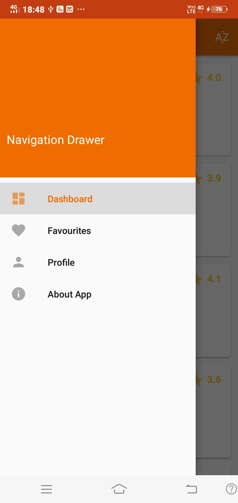
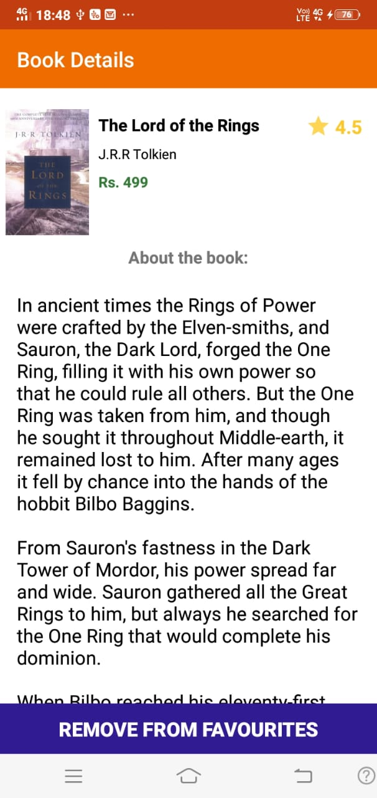
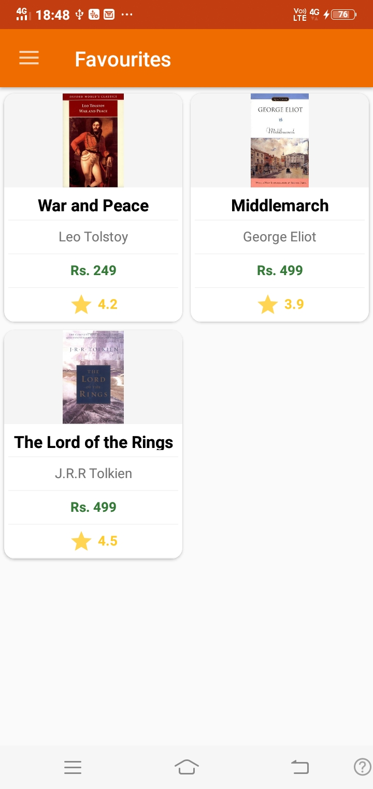
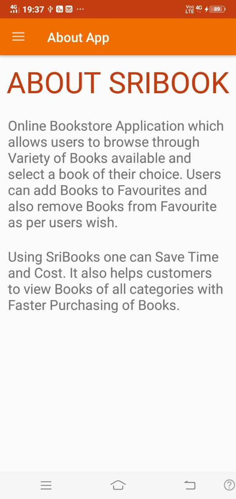

# SRIBOOKS :books:
---
# Overview :scroll:
---
## :thought_balloon: SriBooks is a Sample Android Book application using which users can access Books Online by Browsing through variety of Books Available.
## :thought_balloon: Users can also save the Books by adding it to Favourites.
## :thought_balloon: Users can also remove Book from Favourites whenever they want to do so.
---
## How to user
From your command line:

```bash
# Fork the Repository

# Clone this repository to Remote Environment using Git Bash
$ git clone https://github.com/TechieMeSB/SriBooks.git

```
Open Android Studio and Navigate to location of SriBooks in Remote Environment then run the application.

---
# Screenshot of Application :iphone:
<div >
  
  
  
</div>
<br>
<div >
  
  
</div>
<br>
<div >
  
  
</div>
<br>

---
# Tools and Language Used :wrench:
[](#)
<br>
[](#)
<br>
[](#)
